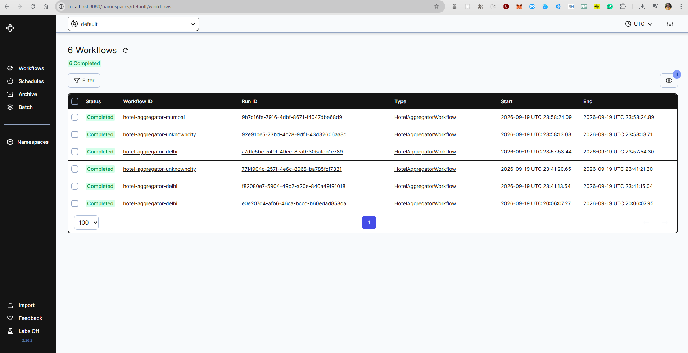
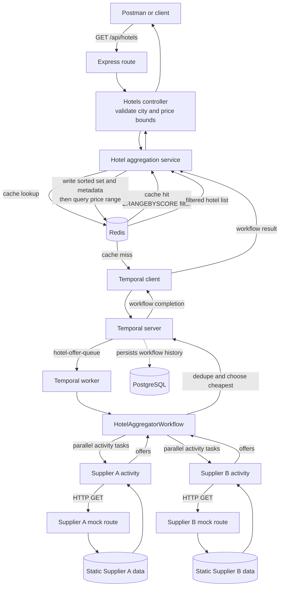

# 🏨 Hotel Offer Orchestrator

> Aggregate overlapping hotel offers from two mock suppliers, deduplicate by best price, and filter results — orchestrated by **Temporal.io**, cached in **Redis**, served via **Express + TypeScript**.

---

## Architecture

```
Client → Express API → Temporal Workflow → [Supplier A Activity ‖ Supplier B Activity]
                   ↓                               ↓
              Redis ZSET              deduplicateAndSelectBest()
          (ZRANGEBYSCORE)                    (in workflow)
```

- **Two supplier HTTP activities** run in **parallel** inside a Temporal Workflow
- **Deduplication + best-price selection** lives inside the workflow (replayable, auditable)
- **Redis Sorted Set** stores hotels with `score=price` → `ZRANGEBYSCORE` for O(log N + M) price filtering, where M is the result count
- **Same Docker image, two roles**: `ROLE=api` starts Express; `ROLE=worker` starts Temporal Worker

---

## Assessment Deployment (Docker Compose)

This Compose deployment runs the complete assessment stack: the Express API and mock supplier routes, a separate Temporal worker, Temporal Server, PostgreSQL for Temporal history, Redis for hotel offers, and the Temporal Web UI.

### Prerequisites and configuration

- Git and Docker Desktop (Windows/macOS) or Docker Engine with the Docker Compose plugin (Linux).
- Make sure host ports `3000`, `6379`, `7233`, and `8080` are available. PostgreSQL is reachable only inside the Compose network and does not publish a host port.
- No supplier credentials, API keys, or `.env` file are required for this mock-data deployment. Compose supplies the service hostnames and settings. `.env.example` is a reference for local development; the app does not load it automatically.

### Deploy the stack

1. Clone the repository and move into its root directory:

   ```bash
   git clone <your-github-repository-url>
   cd hotel-offer-orchestrator
   ```

2. Build the production Docker image and start all services in the background:

   ```bash
   docker compose up --build -d
   ```

   The API and worker use the same `Dockerfile` image with different roles (`ROLE=api` and `ROLE=worker`). Compose starts PostgreSQL and Redis first, waits for Temporal and Redis health checks before starting the API, then starts the worker.

3. Check that the services are running and inspect startup logs if needed:

   ```bash
   docker compose ps
   docker compose logs --tail=100 temporal api worker
   ```

   Temporal may take around 30 seconds to initialise on the first start. Wait until the API is running and its dependencies are ready before sending requests.

4. Verify the application health endpoint:

   ```bash
   curl --fail-with-body http://localhost:3000/health
   ```

   A fully ready stack returns HTTP `200` and `"status":"healthy"`, with `supplierA`, `supplierB`, `temporal`, and `redis` each marked `"status":"up"`. The endpoint returns `207` for a degraded stack and `503` when Temporal or Redis is unavailable.

### Verify the assessment requirements

Use Postman or curl to confirm the aggregation and filtering behavior:

```bash
# First uncached request: starts the Temporal workflow and populates Redis
curl -i "http://localhost:3000/api/hotels?city=delhi"

# Repeat: should be served from Redis (X-Cache: HIT)
curl -i "http://localhost:3000/api/hotels?city=delhi"

# Inclusive price filter, applied through Redis ZRANGEBYSCORE
curl -i "http://localhost:3000/api/hotels?city=delhi&minPrice=4000&maxPrice=9000"

# Unknown city returns HTTP 200 with []
curl -i "http://localhost:3000/api/hotels?city=unknowncity"
```

On an uncached city, expect `X-Cache: MISS` and a Temporal run ID when available. The response contains one best-priced offer per hotel name; the repeated request should return `X-Cache: HIT`. If the city already has a cache entry, the first request may also be a cache hit. The default cache TTL is five minutes.

To run the included request assertions, import [`postman/HotelOfferOrchestrator.postman_collection.json`](postman/HotelOfferOrchestrator.postman_collection.json) into Postman, leave or set the `base_url` collection variable to `http://localhost:3000`, and run the collection. Run the health request first to confirm readiness. The collection covers deduplication, price filters, cache hits, validation failures, empty results, raw supplier responses, and the optional direct supplier-outage checks.

Verify orchestration in [Temporal Web UI](http://localhost:8080): select namespace `default`, open **Workflows**, and inspect a run such as `hotel-aggregator-delhi`. Confirm workflow type `HotelAggregatorWorkflow`, task queue `hotel-offer-queue`, both supplier activities, and the final result. The [Temporal UI walkthrough](#temporal-ui-demo-walkthrough) below explains each screenshot.

You can also inspect the Redis sorted-set query directly:

```bash
docker compose exec redis redis-cli --raw ZRANGEBYSCORE hotel:delhi:prices 4000 9000
```

The result is the serialized selected-hotel entries whose prices are between 4,000 and 9,000, inclusive.

### Service addresses

| Service | Address | Use |
|---|---|---|
| API | `http://localhost:3000` | Hotel API, supplier mocks, and `/health` |
| Temporal Web UI | `http://localhost:8080` | Inspect workflow executions and event history |
| Temporal gRPC | `localhost:7233` | Temporal client/worker connection |
| Redis | `localhost:6379` | Cache inspection from the host |
| PostgreSQL | Compose-internal only | Temporal persistence; no host port is published |

### Logs and shutdown

Follow service logs while debugging startup or requests:

```bash
docker compose logs -f api worker temporal redis postgres
```

Stop the containers and network when finished:

```bash
docker compose down
```

This keeps the named Redis and PostgreSQL volumes, so cached data and Temporal history remain for the next start. To remove those volumes and reset local state as well, run `docker compose down --volumes`.

## AWS Deployment (Amazon EC2)

This procedure runs the existing Docker Compose stack on one Ubuntu EC2 instance. It is suitable for an assessment demo: the hotel API is reachable over HTTP, while Redis, Temporal gRPC, and the Temporal UI stay private to the instance. For a public production service, put the API behind HTTPS and add authentication and monitoring.

### 1. Launch an EC2 instance

In the [EC2 console](https://docs.aws.amazon.com/AWSEC2/latest/UserGuide/EC2_GetStarted.html), choose a region close to the users (for example, Mumbai, `ap-south-1`, for an India-based demo), then launch an instance with:

- **AMI:** Ubuntu Server 24.04 LTS, 64-bit x86.
- **Instance type:** `t3.large` (2 vCPUs and 8 GiB memory), which leaves room for Temporal, PostgreSQL, Redis, the API, and the worker on one host. See [T3 instance specifications](https://aws.amazon.com/ec2/instance-types/t3/).
- **Storage:** 40 GiB General Purpose SSD (`gp3`); keep **Delete on termination** enabled for the root volume unless you intend to retain it.
- **Key pair:** create or select an SSH key pair and download the private key. Keep it private; it is used only to connect to the instance.
- **Public IPv4:** enable assignment so Postman can reach the API.

Ubuntu's default SSH username is `ubuntu`. Check the [EC2 launch and connect guide](https://docs.aws.amazon.com/AWSEC2/latest/UserGuide/tutorial-launch-a-test-ec2-instance.html) if you choose a different AMI.

### 2. Configure the EC2 security group

Add inbound rules for:

| Port | Source | Purpose |
|---|---|---|
| TCP 22 | Your current public IP only | SSH administration |
| TCP 3000 | The reviewer/client IPs, or `0.0.0.0/0` for a publicly accessible assessment demo | Hotel API and mock supplier endpoints |

If you use IPv6, add the matching IPv6 rule for port 3000. Do **not** add public rules for ports `6379` (Redis), `7233` (Temporal gRPC), `8080` (Temporal UI), or `5432` (PostgreSQL). EC2 security groups act as the instance firewall; see [AWS security group rules](https://docs.aws.amazon.com/AWSEC2/latest/UserGuide/security-group-rules-reference.html).

### 3. Connect and install Docker Compose

From a terminal on your computer, connect using the downloaded key (replace the key filename and public IP):

```bash
ssh -i hotel-offer-key.pem ubuntu@<EC2-PUBLIC-IP>
```

On the EC2 instance, install Docker Engine and its Compose plugin using Docker's [official Ubuntu package repository](https://docs.docker.com/engine/install/ubuntu/):

```bash
sudo apt-get update
sudo apt-get install -y ca-certificates curl
sudo install -m 0755 -d /etc/apt/keyrings
sudo curl -fsSL https://download.docker.com/linux/ubuntu/gpg -o /etc/apt/keyrings/docker.asc
sudo chmod a+r /etc/apt/keyrings/docker.asc
echo \
  "deb [arch=$(dpkg --print-architecture) signed-by=/etc/apt/keyrings/docker.asc] https://download.docker.com/linux/ubuntu \
  $(. /etc/os-release && echo "${UBUNTU_CODENAME:-$VERSION_CODENAME}") stable" | \
  sudo tee /etc/apt/sources.list.d/docker.list > /dev/null
sudo apt-get update
sudo apt-get install -y docker-ce docker-ce-cli containerd.io docker-buildx-plugin docker-compose-plugin
```

Confirm both commands are available:

```bash
docker --version
docker compose version
```

The commands below use `sudo` so you do not need to add the `ubuntu` account to Docker's privileged group.

### 4. Keep internal service ports private, then deploy

Clone your GitHub repository onto the instance. For a private repository, configure an SSH deploy key on the instance rather than putting a GitHub token in a command or README.

```bash
git clone <your-github-repository-url>
cd hotel-offer-orchestrator
```

Before starting the stack, edit `docker-compose.yml` on the instance and bind the three non-public host ports to loopback. Change their `ports` entries as follows; leave the API mapping as `"3000:3000"` and leave PostgreSQL unpublished:

```yaml
temporal:
  ports:
    - "127.0.0.1:7233:7233"
temporal-ui:
  ports:
    - "127.0.0.1:8080:8080"
redis:
  ports:
    - "127.0.0.1:6379:6379"
```

Build and start the services:

```bash
sudo docker compose up --build -d
sudo docker compose ps
sudo docker compose logs --tail=100 temporal api worker
```

Wait for the API and worker to become healthy/started. The first Temporal startup can take around 30 seconds while it initializes its PostgreSQL schema. No supplier API keys or other external credentials are needed; the supplier endpoints use the project's local fixtures.

### 5. Verify the public API

Replace `<EC2-PUBLIC-IP>` with the instance's public IPv4 address:

```bash
curl -i "http://<EC2-PUBLIC-IP>:3000/health"
curl -i "http://<EC2-PUBLIC-IP>:3000/api/hotels?city=delhi"
curl -i "http://<EC2-PUBLIC-IP>:3000/api/hotels?city=delhi&minPrice=4000&maxPrice=9000"
```

The health endpoint should report the API dependencies and both mock suppliers as up. The hotel response should contain the deduplicated best-priced offers; the bounded request applies the price range in Redis. In Postman, set the `base_url` collection variable to `http://<EC2-PUBLIC-IP>:3000` and run the collection.

### 6. Open Temporal Web UI through an SSH tunnel

The UI is intentionally not exposed to the internet. From your local computer, open an SSH tunnel and keep that terminal session running:

```bash
ssh -i hotel-offer-key.pem -N -L 8080:127.0.0.1:8080 ubuntu@<EC2-PUBLIC-IP>
```

Then visit [http://localhost:8080](http://localhost:8080), select namespace `default`, and inspect the workflow as described in the [Temporal UI walkthrough](#temporal-ui-demo-walkthrough). The same SSH tunnel can be closed when you are done.

### Updating or removing the deployment

To deploy a newer commit, SSH into the instance and run:

```bash
cd hotel-offer-orchestrator
git pull
sudo docker compose up --build -d
```

To stop the containers, run `sudo docker compose down` in the repository directory. This does not stop EC2 billing. When the demo is finished, terminate the instance in the EC2 console and check for any retained EBS volumes, snapshots, or Elastic IPs. AWS documents [instance termination and attached-volume behavior here](https://docs.aws.amazon.com/AWSEC2/latest/UserGuide/how-ec2-instance-termination-works.html).

## Temporal UI Demo Walkthrough

The screenshots below show a completed `HotelAggregatorWorkflow` execution in the Temporal Web UI. To follow the same flow yourself, start the Docker Compose stack, then send `GET http://localhost:3000/api/hotels?city=mumbai` from Postman or curl. On a cache miss, the API starts the workflow and waits for its result. The result is then written to Redis. A later request served from Redis does not create a new workflow execution, so use a city whose cache has expired (the default TTL is five minutes) when you want to watch a fresh run.

Open [Temporal Web UI](http://localhost:8080), select the `default` namespace, and choose **Workflows** in the left navigation.

### 1. Find the execution



The list shows completed runs, their Workflow IDs, run IDs, workflow type, and start/end times. The ID follows `hotel-aggregator-<city>`; the screenshot includes Delhi, Mumbai, and unknown-city runs. Select `hotel-aggregator-mumbai` to inspect the Mumbai execution shown in the remaining screenshots.

### 2. Review workflow summary and parallel activity timeline


The workflow detail page identifies the workflow type (`HotelAggregatorWorkflow`), task queue (`hotel-offer-queue`), run ID, completion status, and duration. In the **Timeline**, `fetchFromSupplierA` and `fetchFromSupplierB` appear as separate activity rows whose execution intervals overlap. This is the Temporal UI view of the two supplier calls being scheduled concurrently.

### 3. Inspect the workflow input and result


Expand **Input and Results** on the workflow detail page. The input contains the requested city (`mumbai`) and a correlation ID. The result is the final de-duplicated hotel array returned by the workflow; the visible beginning includes `Juhu Residency`, `Marrine`, and `The Fern Goregaon` with the selected prices and supplier names.

### 4. Trace the event history


The **Event History** records the execution lifecycle: `WorkflowExecutionStarted`, workflow task events, activity scheduling and completion, and finally `WorkflowExecutionCompleted`. The two supplier activity scheduling events are separate entries. Use this history to verify that both activity results were collected before the workflow completed.

### 5. Expand the workflow completion result


Expanding `WorkflowExecutionCompleted` shows the array returned by the workflow. For this Mumbai run, the result starts with `Juhu Residency` at 3,900 from Supplier A, `Marrine` at 5,200 from Supplier B, and `The Fern Goregaon` at 6,500 from Supplier A. The public API returns this same result shape, without the supplier fixture's internal `hotelId` and `city` fields.

### 6. Inspect raw supplier activity results


Expand each `ActivityTaskCompleted` event to see the raw offers returned by the corresponding supplier activity. These payloads include `hotelId`, `name`, `price`, `commissionPct`, and `city`. Comparing the two activity results with the workflow completion result lets you verify that overlapping names were resolved to the lower-priced offer and supplier-only hotels were retained.

Temporal event timestamps in these saved screenshots are in UTC and represent the captured demo run. New executions will have different run IDs, timestamps, and correlation IDs.

## Architecture Explained

The demo follows the same path as a real request: Express handles the HTTP boundary, the application service coordinates cache and workflow work, Temporal runs durable orchestration, and Redis stores the completed offers for fast reads. The supplier APIs are local mock endpoints so the flow can be run without external accounts or API keys.



### What each part does

| Component | Responsibility |
|---|---|
| Express routes and controllers | The hotels request is split across `src/api/routes/hotels.route.ts` -> `src/api/controllers/hotels.controller.ts` -> `src/services/hotelAggregator.service.ts`. The route maps the URL to its controller; the controller normalizes and validates query parameters, calls the service, and maps the result or error to HTTP. Correlation middleware adds `X-Correlation-Id` for tracing. |
| Hotel aggregation service | Checks Redis first. On a cache miss it starts or joins the city's Temporal workflow, waits for the result, saves the full deduplicated list, and queries Redis again with the requested price bounds. It can serve a stale snapshot if workflow execution fails and stale-cache support is enabled. |
| Temporal server | Accepts workflow starts, records workflow history durably in PostgreSQL, and dispatches workflow and activity tasks through the configured task queue. The server coordinates execution; it does not call the suppliers itself. |
| Temporal worker and workflow | The worker in `src/temporal/worker.ts` polls `hotel-offer-queue` and executes `HotelAggregatorWorkflow` from `src/temporal/workflows/`. The workflow schedules Supplier A and Supplier B activities concurrently, waits for their outcomes, then deduplicates by normalized hotel name and returns the cheaper offer. A listing supplied by only one supplier is retained. |
| Supplier activities and mock routes | Activities in `src/temporal/activities/supplierActivities.ts` perform HTTP requests to `/supplierA/hotels` and `/supplierB/hotels`, validate the returned offer fields, and report failures to Temporal. The local routes read static fixtures from `src/data/mockSupplierData.ts`. |
| Redis | Stores each city's selected hotels in a sorted set, using price as the score and the serialized hotel as the member. `ZRANGEBYSCORE` applies inclusive minimum and maximum filters in Redis. Cache metadata uses the configured TTL (five minutes by default); the separate last-good snapshot is retained for up to 24 hours for stale fallback. |
| PostgreSQL | Stores Temporal's execution history so the Temporal UI can show workflow inputs, activity events, outputs, status, and timing after a run completes. |
| Temporal Web UI | Reads Temporal history for operators and reviewers. It visualizes workflow and activity execution; it is not in the live API request path. |

### One request, end to end

1. A client calls `GET /api/hotels?city=mumbai&minPrice=4000&maxPrice=10000`. Express middleware assigns a correlation ID; the route sends the request to the controller, which validates and normalizes the query.
2. The aggregation service asks Redis for that city's data. If the cache exists, Redis returns only the scores in range and the API responds without starting Temporal.
3. On a cache miss, the service starts `HotelAggregatorWorkflow` with a deterministic ID such as `hotel-aggregator-mumbai` and waits for its result. Concurrent requests for the same city can join the running workflow.
4. The Temporal worker receives the workflow task from `hotel-offer-queue`. The workflow schedules both supplier activities at once. Each activity makes an HTTP call to its mock route, validates the returned records, and reports its result to the workflow.
5. The workflow uses the results to select the cheapest offer for each normalized hotel name, keeps supplier-only hotels, sorts by price, and completes. If one supplier fails, the successful supplier's offers can still be returned; if both fail, the workflow fails and the service tries its stale snapshot before returning a service error.
6. The API service writes the complete selected list to Redis and runs the requested price range through Redis. The controller returns the JSON list with cache, correlation, and available Temporal run headers.
7. Temporal's event history records the workflow and activity transitions. The screenshots above show how to inspect that history in the Web UI.

In Docker Compose, the API and worker use the same application image with separate roles (`ROLE=api` and `ROLE=worker`). The API serves both the public hotel endpoint and the two mock supplier endpoints; the worker reaches those endpoints over the Compose network. Temporal, PostgreSQL, Redis, the API, and the worker are separate services, so the workflow worker can be scaled independently from HTTP traffic.

---

## Local Development (without Docker)

**Prerequisites:** Node.js 20+, Redis 7+, and Temporal CLI (or Docker for Temporal)

The local defaults in `src/config/env.ts` target `localhost` for Redis, Temporal, and the mock supplier API. The application reads environment variables from the process; it does not automatically load a `.env` file. `.env.example` is a reference template. Set any overrides in the shell where you start each process. Docker Compose has its own service configuration in `docker-compose.yml`.

```bash
# Install dependencies
npm install

# Start Temporal locally (requires Temporal CLI)
temporal server start-dev

# Terminal 1 — API server
npm run dev:api

# Terminal 2 — Temporal Worker
npm run dev:worker
```

---

## API Reference

### `GET /api/hotels`

Fetches deduplicated, best-priced hotels for a city.

| Param | Type | Required | Description |
|---|---|---|---|
| `city` | string | ✅ | City name (case-insensitive) |
| `minPrice` | number | ❌ | Minimum price (inclusive) |
| `maxPrice` | number | ❌ | Maximum price (inclusive) |

**Examples:**
```bash
# All hotels for Delhi
curl "http://localhost:3000/api/hotels?city=delhi"

# Hotels between ₹4,000 and ₹9,000
curl "http://localhost:3000/api/hotels?city=delhi&minPrice=4000&maxPrice=9000"

# Hotels above ₹10,000
curl "http://localhost:3000/api/hotels?city=delhi&minPrice=10000"
```

**Example response excerpt:**

The full Delhi response contains 24 deduplicated hotels; these entries illustrate the selected winners.

```json
[
  { "name": "Holtin",  "price": 5340, "supplier": "Supplier B", "commissionPct": 20 },
  { "name": "Radison", "price": 5900, "supplier": "Supplier A", "commissionPct": 13 }
]
```

**Response Headers:**
- `X-Cache: HIT | MISS` — whether Redis served the response
- `X-Correlation-Id: <uuid>` — trace ID for every request
- `X-Temporal-Run-Id: <runId>` — Temporal run that produced this data when a run ID is available
- `X-Data-Stale: true` — when stale cache fallback is served

---

### `GET /health`

Independent health probe for all four dependencies.

```bash
curl http://localhost:3000/health
```

```json
{
  "status": "healthy",
  "timestamp": "2026-09-19T17:28:04.000Z",
  "uptime": 3622.4,
  "dependencies": {
    "supplierA": { "status": "up", "latencyMs": 3 },
    "supplierB": { "status": "up", "latencyMs": 4 },
    "temporal":  { "status": "up", "latencyMs": 12 },
    "redis":     { "status": "up", "latencyMs": 1 }
  }
}
```

HTTP status: `200` healthy · `207` degraded · `503` unhealthy

---

### Mock Supplier Endpoints

```bash
GET /supplierA/hotels?city=delhi   # Raw Supplier A data
GET /supplierB/hotels?city=delhi   # Raw Supplier B data

# Simulate supplier outage (header-triggered)
curl -H "X-Simulate-Down: true" http://localhost:3000/supplierB/hotels?city=delhi
# → 503
```

---

## Postman Collection

Import `postman/HotelOfferOrchestrator.postman_collection.json` into Postman.

Set collection variable `base_url = http://localhost:3000` and run all requests.

Requests and assertions included:
- Deduplication correctness (Holtin → Supplier B, Radison → Supplier A)
- Cache header presence and HIT behavior on a repeated request
- Price range filtering accuracy
- Query validation errors (400) and an unknown city returning an empty array (200)
- Health check dependency structure
- Supplier failure simulation

### Postman request guide

The collection contains 15 requests. Every request uses **GET**, has **no request body**, and uses the `base_url` collection variable (default `http://localhost:3000`). Query parameters shown below are part of each request URL. Only the two supplier outage checks send an extra header.

| # | Collection request | URL / query parameters | Extra headers | Expected response |
|---:|---|---|---|---|
| 1 | Valid city — full list | `GET {{base_url}}/api/hotels?city=delhi` | None | `200`; 24 deduplicated hotel objects sorted by price ascending. `X-Cache` is `HIT` or `MISS`, and `X-Correlation-Id` is present. |
| 2 | Same city — cache HIT | `GET {{base_url}}/api/hotels?city=delhi` | None | `200`; same 24 hotels; `X-Cache: HIT` because request 1 populated Redis. Run after request 1 without waiting for the cache TTL to expire. |
| 3 | Price range filter | `GET {{base_url}}/api/hotels?city=delhi&minPrice=4000&maxPrice=9000` | None | `200`; 11 hotels, including both boundaries, with prices from 4,000 through 9,000. Redis applies the range with `ZRANGEBYSCORE` when the cache is available. |
| 4 | Minimum price only | `GET {{base_url}}/api/hotels?city=delhi&minPrice=10000` | None | `200`; 11 hotels, all priced at least 10,000. |
| 5 | Maximum price only | `GET {{base_url}}/api/hotels?city=delhi&maxPrice=5500` | None | `200`; 3 hotels, all priced at most 5,500. |
| 6 | City with no results | `GET {{base_url}}/api/hotels?city=unknowncity` | None | `200`; empty JSON array `[]`. |
| 7 | Missing city | `GET {{base_url}}/api/hotels` | None | `400`; JSON validation error with code `MISSING_CITY`. |
| 8 | Invalid minimum price | `GET {{base_url}}/api/hotels?city=delhi&minPrice=abc` | None | `400`; JSON validation error with code `INVALID_MIN_PRICE`. |
| 9 | Reversed price range | `GET {{base_url}}/api/hotels?city=delhi&minPrice=9000&maxPrice=4000` | None | `400`; JSON validation error with code `INVALID_PRICE_RANGE`. |
| 10 | Mumbai city | `GET {{base_url}}/api/hotels?city=mumbai` | None | `200`; 20 deduplicated hotel objects sorted by price ascending. |
| 11 | Supplier A — Delhi offers | `GET {{base_url}}/supplierA/hotels?city=delhi` | None | `200`; 20 raw Supplier A offers with `hotelId`, `name`, `price`, `city`, and `commissionPct`. |
| 12 | Supplier B — Delhi offers | `GET {{base_url}}/supplierB/hotels?city=delhi` | None | `200`; 20 raw Supplier B offers in the same supplier response format. |
| 13 | Simulate Supplier B down | `GET {{base_url}}/supplierB/hotels?city=delhi` | `X-Simulate-Down: true` | `503`; `{"error":"Supplier B is simulated as down"}`. This calls the mock endpoint directly. |
| 14 | Simulate Supplier A down | `GET {{base_url}}/supplierA/hotels?city=delhi` | `X-Simulate-Down: true` | `503`; `{"error":"Supplier A is simulated as down"}`. This calls the mock endpoint directly. |
| 15 | Health — dependencies | `GET {{base_url}}/health` | None | Normally `200` with all dependencies up; `207` when a supplier is down; `503` when Temporal or Redis is down. The body reports the status of both suppliers, Temporal, and Redis. |

### Request and response details

#### Hotel search and price filtering

`city` is required, trimmed, and case-insensitive. `minPrice` and `maxPrice` are optional, non-negative numbers; each bound is inclusive. Supplying both with `minPrice > maxPrice` returns `400`. On normal cache reads and after a successful workflow refresh, Redis applies the range with `ZRANGEBYSCORE`; the service applies the same bounds in TypeScript only as a fallback if Redis cannot serve the result. Successful responses are JSON arrays with this public response shape (supplier `hotelId` and `city` are intentionally omitted):

```json
{
  "name": "Holtin",
  "price": 5340,
  "supplier": "Supplier B",
  "commissionPct": 20
}
```

The full Delhi response for request 1 is:

```json
[
  { "name": "Lemon Tree", "price": 4200, "supplier": "Supplier A", "commissionPct": 15 },
  { "name": "Hotel Samrat", "price": 5200, "supplier": "Supplier A", "commissionPct": 18 },
  { "name": "Holtin", "price": 5340, "supplier": "Supplier B", "commissionPct": 20 },
  { "name": "Radison", "price": 5900, "supplier": "Supplier A", "commissionPct": 13 },
  { "name": "The Suryaa", "price": 6100, "supplier": "Supplier A", "commissionPct": 16 },
  { "name": "Lemon Tree Premier", "price": 6800, "supplier": "Supplier A", "commissionPct": 13 },
  { "name": "The Park New Delhi", "price": 7100, "supplier": "Supplier B", "commissionPct": 16 },
  { "name": "Radisson Blu Plaza Delhi Airport", "price": 7300, "supplier": "Supplier B", "commissionPct": 16 },
  { "name": "Eros Hotel", "price": 7900, "supplier": "Supplier A", "commissionPct": 15 },
  { "name": "The Lalit", "price": 8100, "supplier": "Supplier B", "commissionPct": 18 },
  { "name": "The Grand New Delhi", "price": 8900, "supplier": "Supplier B", "commissionPct": 13 },
  { "name": "Hyatt Regency Delhi", "price": 9200, "supplier": "Supplier B", "commissionPct": 13 },
  { "name": "Le Meridien New Delhi", "price": 9200, "supplier": "Supplier A", "commissionPct": 11 },
  { "name": "Shangri-La Eros New Delhi", "price": 10500, "supplier": "Supplier A", "commissionPct": 9 },
  { "name": "Pullman New Delhi Aerocity", "price": 11200, "supplier": "Supplier B", "commissionPct": 11 },
  { "name": "Taj Palace", "price": 11500, "supplier": "Supplier B", "commissionPct": 9 },
  { "name": "ITC Maurya", "price": 11500, "supplier": "Supplier A", "commissionPct": 10 },
  { "name": "Roseate House", "price": 11800, "supplier": "Supplier B", "commissionPct": 10 },
  { "name": "JW Marriott New Delhi Aerocity", "price": 12900, "supplier": "Supplier B", "commissionPct": 9 },
  { "name": "The Oberoi", "price": 13800, "supplier": "Supplier B", "commissionPct": 9 },
  { "name": "The Claridges", "price": 14900, "supplier": "Supplier B", "commissionPct": 11 },
  { "name": "Andaz Delhi", "price": 15300, "supplier": "Supplier B", "commissionPct": 9 },
  { "name": "Taj Mahal Hotel", "price": 16500, "supplier": "Supplier B", "commissionPct": 8 },
  { "name": "The Imperial", "price": 17500, "supplier": "Supplier B", "commissionPct": 8 }
]
```

Request 3 returns these 11 entries:

```json
[
  { "name": "Lemon Tree", "price": 4200, "supplier": "Supplier A", "commissionPct": 15 },
  { "name": "Hotel Samrat", "price": 5200, "supplier": "Supplier A", "commissionPct": 18 },
  { "name": "Holtin", "price": 5340, "supplier": "Supplier B", "commissionPct": 20 },
  { "name": "Radison", "price": 5900, "supplier": "Supplier A", "commissionPct": 13 },
  { "name": "The Suryaa", "price": 6100, "supplier": "Supplier A", "commissionPct": 16 },
  { "name": "Lemon Tree Premier", "price": 6800, "supplier": "Supplier A", "commissionPct": 13 },
  { "name": "The Park New Delhi", "price": 7100, "supplier": "Supplier B", "commissionPct": 16 },
  { "name": "Radisson Blu Plaza Delhi Airport", "price": 7300, "supplier": "Supplier B", "commissionPct": 16 },
  { "name": "Eros Hotel", "price": 7900, "supplier": "Supplier A", "commissionPct": 15 },
  { "name": "The Lalit", "price": 8100, "supplier": "Supplier B", "commissionPct": 18 },
  { "name": "The Grand New Delhi", "price": 8900, "supplier": "Supplier B", "commissionPct": 13 }
]
```

Requests 4 and 5 return:

Request 4 (`minPrice=10000`) returns 11 hotels:

```json
[
  { "name": "Shangri-La Eros New Delhi", "price": 10500, "supplier": "Supplier A", "commissionPct": 9 },
  { "name": "Pullman New Delhi Aerocity", "price": 11200, "supplier": "Supplier B", "commissionPct": 11 },
  { "name": "Taj Palace", "price": 11500, "supplier": "Supplier B", "commissionPct": 9 },
  { "name": "ITC Maurya", "price": 11500, "supplier": "Supplier A", "commissionPct": 10 },
  { "name": "Roseate House", "price": 11800, "supplier": "Supplier B", "commissionPct": 10 },
  { "name": "JW Marriott New Delhi Aerocity", "price": 12900, "supplier": "Supplier B", "commissionPct": 9 },
  { "name": "The Oberoi", "price": 13800, "supplier": "Supplier B", "commissionPct": 9 },
  { "name": "The Claridges", "price": 14900, "supplier": "Supplier B", "commissionPct": 11 },
  { "name": "Andaz Delhi", "price": 15300, "supplier": "Supplier B", "commissionPct": 9 },
  { "name": "Taj Mahal Hotel", "price": 16500, "supplier": "Supplier B", "commissionPct": 8 },
  { "name": "The Imperial", "price": 17500, "supplier": "Supplier B", "commissionPct": 8 }
]

```

Request 5 (`maxPrice=5500`) returns 3 hotels:

```json
[
  { "name": "Lemon Tree", "price": 4200, "supplier": "Supplier A", "commissionPct": 15 },
  { "name": "Hotel Samrat", "price": 5200, "supplier": "Supplier A", "commissionPct": 18 },
  { "name": "Holtin", "price": 5340, "supplier": "Supplier B", "commissionPct": 20 }
]
```

#### Validation error responses

All API validation errors include a `correlationId`; the matching `X-Correlation-Id` response header carries the same ID. The ID below is illustrative and changes per request.

Request 7 (missing city, HTTP `400`):

```json
{
  "error": "`city` query parameter is required",
  "code": "MISSING_CITY",
  "correlationId": "<request-correlation-id>"
}
```

Request 8 (invalid `minPrice`, HTTP `400`):

```json
{
  "error": "`minPrice` must be a non-negative number",
  "code": "INVALID_MIN_PRICE",
  "correlationId": "<request-correlation-id>"
}
```

Request 9 (`minPrice` is greater than `maxPrice`, HTTP `400`):

```json
{
  "error": "`minPrice` must be less than or equal to `maxPrice`",
  "code": "INVALID_PRICE_RANGE",
  "correlationId": "<request-correlation-id>"
}
```

Request 6's response body is exactly `[]`. Request 2 has the same array body as request 1, with `X-Cache: HIT`. Other successful `/api/hotels` responses set `X-Cache: HIT | MISS` and `X-Correlation-Id`; a workflow run ID is included in `X-Temporal-Run-Id` when available, and stale cache fallback sets `X-Data-Stale: true`.

#### Mumbai example (request 10)

The response has 20 entries in the same public hotel shape, ordered by price. Its first entries are:

```json
[
  { "name": "Juhu Residency", "price": 3900, "supplier": "Supplier A", "commissionPct": 18 },
  { "name": "Marrine", "price": 5200, "supplier": "Supplier B", "commissionPct": 16 },
  { "name": "The Fern Goregaon", "price": 6500, "supplier": "Supplier A", "commissionPct": 17 }
]
```

This response excerpt shows the first three items; the actual response contains all 20 and is sorted by ascending price. The static source inventory is documented below in `src/data/mockSupplierData.ts`.

#### Direct mock supplier responses (requests 11–14)

Normal supplier requests return the raw offer format, including the supplier-specific ID and city. Each supplier has 20 Delhi offers. For example, Supplier A returns:

```json
[
  { "hotelId": "a1", "name": "Holtin", "price": 6000, "city": "delhi", "commissionPct": 10 },
  { "hotelId": "a2", "name": "Radison", "price": 5900, "city": "delhi", "commissionPct": 13 }
]
```

Supplier B returns:

```json
[
  { "hotelId": "b1", "name": "Holtin", "price": 5340, "city": "delhi", "commissionPct": 20 },
  { "hotelId": "b2", "name": "Radison", "price": 6400, "city": "delhi", "commissionPct": 12 }
]
```

The examples show the first two records; the actual responses contain all 20 records. The full Delhi, Mumbai, and Bangalore fixtures for both suppliers are maintained in [`src/data/mockSupplierData.ts`](src/data/mockSupplierData.ts). The outage requests return one JSON object and HTTP `503`, for example `{"error":"Supplier B is simulated as down"}`. The simulation header affects only the direct mock endpoint; the aggregation workflow does not forward this header to supplier activities.

#### Health response (request 15)

There is no request body or query parameter. `timestamp`, `uptime`, and each `latencyMs` are live values, so the sample values vary. A healthy response looks like:

```json
{
  "status": "healthy",
  "timestamp": "<ISO-8601 timestamp>",
  "uptime": 12.34,
  "dependencies": {
    "supplierA": { "status": "up", "latencyMs": 3 },
    "supplierB": { "status": "up", "latencyMs": 4 },
    "temporal": { "status": "up", "latencyMs": 12 },
    "redis": { "status": "up", "latencyMs": 1 }
  }
}
```

Each dependency can also include an `error` string when down. Overall status is `degraded` if a supplier is down while Temporal and Redis remain available, and `unhealthy` if Temporal or Redis is down. HTTP status codes are `200`, `207`, and `503` for those states respectively.

---

## Project Structure

Express requests follow `src/api/routes/ -> src/api/controllers/ -> src/services/`. Routes map URLs to handlers, controllers validate HTTP input and shape responses, and services own orchestration and data access. Shared logging lives in `src/infrastructure/logger.ts`; typed HTTP errors live in `src/api/errors/httpError.ts`.

Both Temporal supplier activities are implemented in `src/temporal/activities/supplierActivities.ts`.

```
src/
├── api/
│   ├── controllers/     hotels · health · supplier
│   ├── errors/          typed HTTP errors
│   ├── middleware/     correlationId · requestLogger · errorHandler
│   ├── routes/          hotels · health · supplierA · supplierB
│   └── server.ts        Express app factory
├── temporal/
│   ├── activities/      fetchFromSupplierA · fetchFromSupplierB
│   ├── workflows/       HotelAggregatorWorkflow
│   ├── client.ts        Temporal Client singleton
│   └── worker.ts        Temporal Worker entry
├── services/
│   ├── hotelAggregator.service.ts   Core orchestration (cache → Temporal → cache)
│   ├── supplier.service.ts          Mock supplier adapter and latency
│   ├── redis.service.ts             ZSET read/write helpers
│   └── health.service.ts            Dependency probe logic
├── domain/
│   ├── hotel.types.ts               All TypeScript interfaces
│   └── deduplication.ts            Pure dedup function
├── infrastructure/
│   └── logger.ts                    Shared structured logger
├── data/
│   └── mockSupplierData.ts         Static mock hotel datasets
├── config/
│   └── env.ts                      Zod-validated env vars
└── index.ts                        Entrypoint (ROLE-based boot)
```

Mock inventory includes 20 offers per supplier for Delhi, 15 for Mumbai, and 10 for Bangalore. After deduplication, the expected totals are 24, 20, and 14 hotels respectively. Each city has overlapping hotels with different prices plus supplier-only listings, so both comparison and deduplication cases are represented.

---

## Key Design Decisions

| Decision | Rationale |
|---|---|
| Dedup logic inside Temporal Workflow | Replayable, auditable via Temporal UI, retryable at activity level |
| Redis Sorted Set (not plain JSON) | `ZRANGEBYSCORE` gives O(log N + M) price filtering, where M is the result count |
| `Promise.allSettled` in workflow | Graceful degradation — one supplier down doesn't kill the request |
| Deterministic `workflowId` | Concurrent cold requests can join the same in-flight city workflow |
| Two roles, one image | Worker and API scale independently without separate codebases |
| Stale cache fallback | Serves slightly old data rather than erroring when all systems fail |

---

## Environment Variables

| Variable | Default | Description |
|---|---|---|
| `NODE_ENV` | `development` | `development`, `production`, or `test` |
| `PORT` | `3000` | HTTP server port |
| `ROLE` | `api` | `api` or `worker` |
| `TEMPORAL_ADDRESS` | `localhost:7233` | Temporal gRPC endpoint |
| `TEMPORAL_NAMESPACE` | `default` | Temporal namespace |
| `TEMPORAL_TASK_QUEUE` | `hotel-offer-queue` | Task queue name |
| `REDIS_HOST` | `localhost` | Redis host |
| `REDIS_PORT` | `6379` | Redis port |
| `REDIS_PASSWORD` | unset | Optional Redis password |
| `REDIS_CACHE_TTL_SECONDS` | `300` | Cache TTL (5 min) |
| `SUPPLIER_A_BASE_URL` | `http://localhost:3000` | Supplier A base URL |
| `SUPPLIER_B_BASE_URL` | `http://localhost:3000` | Supplier B base URL |
| `ALLOW_STALE_CACHE` | `true` | Serve stale data on supplier failure |
| `SUPPLIER_REQUEST_TIMEOUT_MS` | `5000` | Activity HTTP timeout |
| `HEALTH_PROBE_TIMEOUT_MS` | `2000` | Health check probe timeout |

---

## AI-Assisted Development

I used AI as a development aid, while keeping the architecture, implementation choices, and verification under my control.

- **Claude Sonnet — initial approach:** I used Claude Sonnet to generate a first-pass breakdown of the assessment and an implementation approach for `APPROACH.md`. I then checked that plan against the required endpoints, Temporal orchestration, Redis price filtering, and Docker submission requirements before treating it as the project plan.
- **GPT-5 — implementation review and refinement:** I used GPT-5 for targeted help reviewing the route -> controller -> service boundaries, reasoning through parallel supplier activities and partial failures, and keeping the README and Postman collection aligned with the actual code. I used it to explore options and spot gaps; I checked suggested changes against the source before keeping them.

### How I validate AI-assisted work

I trace behavior through the code and confirm it with observable results instead of treating generated explanations as proof:

1. I compare each requirement with its route, controller, service, workflow, activity, and Redis implementation.
2. I use `npm run typecheck` to check TypeScript changes and the Postman collection to exercise successful searches, deduplication, price bounds, invalid input, supplier responses, and health status.
3. For orchestration behavior, I inspect the Temporal Web UI workflow input, task queue, overlapping supplier activity timeline, event history, activity outputs, and final result. I compare the selected offers with the static supplier fixtures.
4. When a check fails, I reproduce the specific request, follow its correlation ID through logs and the relevant layer, inspect Temporal history or Redis behavior when applicable, make a focused change, and rerun the relevant checks.

The Postman collection and Temporal screenshots in this repository make those checks reviewable. AI helped me move faster through planning, code review, and documentation; the evidence and final engineering decisions come from the code, checks, and observed runtime behavior.
